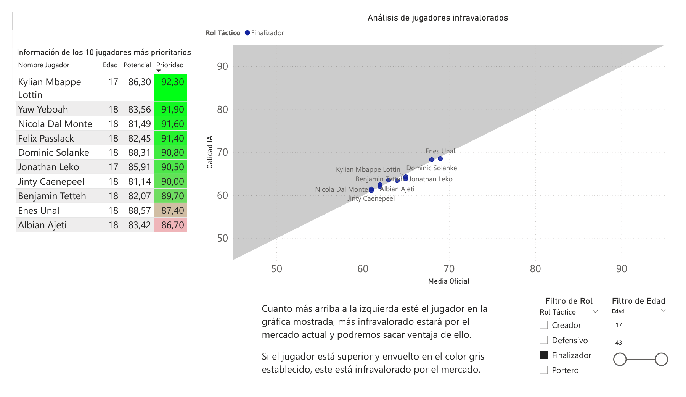
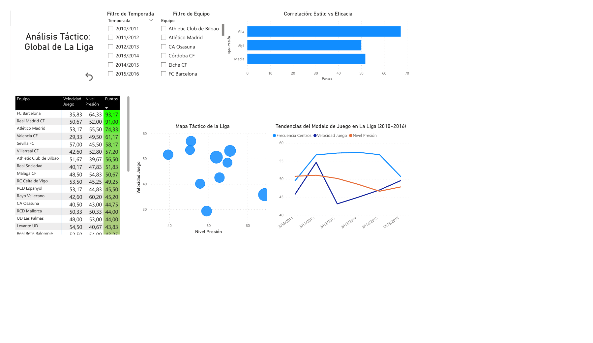
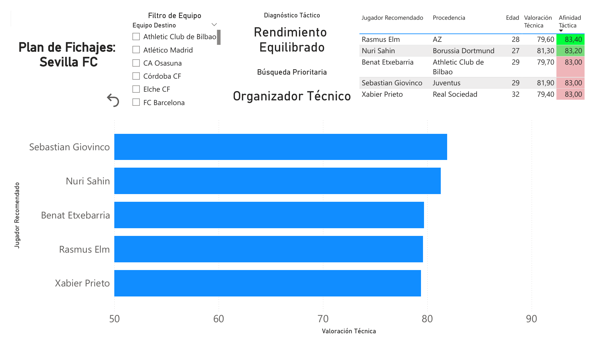

# AEROT-LL: análisis de talento en La Liga

Herramienta de scouting al estilo Moneyball: detecta jugadores infravalorados y recomienda fichajes que cubren las carencias tácticas de cada equipo de La Liga.

Trabajo de la asignatura Inteligencia Empresarial (Universidad de Sevilla, 2026), realizado por **Jorge Hidalgo Puyol** y **Antonio Barrio**.

**Tecnologías:** Python · SQL (SQLite) · pandas · scikit-learn · Power BI

## Qué hace

- **ETL:** consultas SQL sobre la European Soccer Database (más de 25.000 partidos) y limpieza con pandas. Para saber en qué club juega cada jugador, se despivotan con `pd.melt` las 22 columnas de alineación de cada partido y se toma su aparición más reciente.
- **Calidad IA:** valoración técnica de cada jugador de campo con un Random Forest entrenado sobre sus atributos. Los porteros se valoran aparte.
- **Potencial IA e índice de prioridad:** proyección del potencial según la edad e índice de prioridad de fichaje, que combina la ventaja sobre la valoración del mercado (60 %) y el crecimiento esperado (40 %).
- **Diagnóstico de equipos:** alarmas de «falta de gol» o «coladero en defensa» a partir de 1,35 goles por partido, y un índice de prestigio para que las recomendaciones sean realistas.
- **Recomendador por afinidad táctica:** propone a cada equipo los cinco jugadores que mejor encajan con su estilo de juego, sin repetir el mismo fichaje para varios clubes.
- **Cuadro de mando en Power BI** de tres páginas, pensado para una dirección deportiva sin perfil técnico.

## Cuadro de mando

**Talento infravalorado**

**Mapa táctico de La Liga**

**Panel de recomendaciones**

## Contenido

| Archivo | Qué es |
|---|---|
| `AEROT-LL.ipynb` | Código completo: ETL, modelos, recomendador y exportación a CSV para Power BI |
| `docs/memoria.pdf` | Memoria del proyecto |
| `docs/cuadro_de_mando.pdf` | Las tres páginas del cuadro de mando |
| `capturas/` | Imágenes del cuadro de mando |

## Cómo ejecutarlo

1. Descarga la [European Soccer Database](https://www.kaggle.com/datasets/hugomathien/soccer) de Kaggle y deja `database.sqlite` junto al notebook. No se incluye por su tamaño.
2. Instala las dependencias: `pip install -r requirements.txt`
3. Ejecuta `AEROT-LL.ipynb`. Genera los CSV que alimentan el cuadro de mando.

## Autores

- Jorge Hidalgo Puyol · [LinkedIn](https://www.linkedin.com/in/jorge-hidalgo-puyol)
- Antonio Barrio
